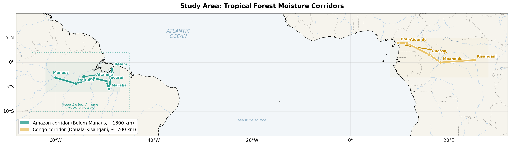
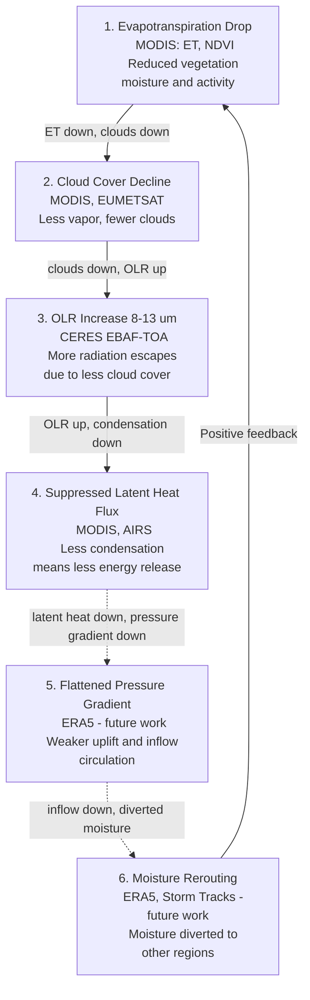
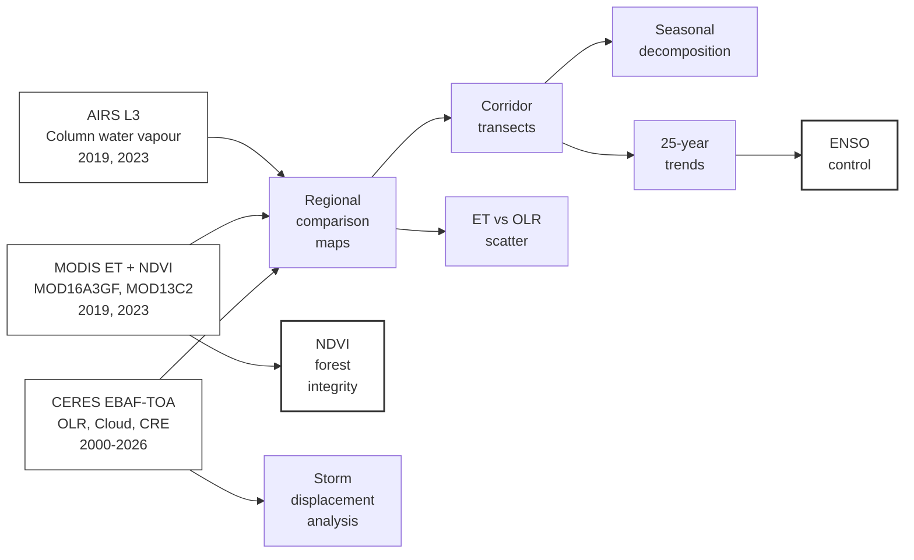

# Biotic Pump Corridor Analysis

Analysis pipeline for **"Satellite evidence for progressive weakening of condensation-driven moisture transport along tropical forest corridors"** (Shahid, 2026).

## Summary

We test the biotic pump hypothesis using 25 years of satellite data along two tropical moisture corridors: Belem-Manaus (Amazon) and Gulf of Guinea-Kisangani (Congo). Four independent instruments (CERES, MODIS, AIRS) show that the predicted signatures of biotic pump breakdown are present, amplify with distance from the coast, concentrate in the SON dry-to-wet transition, and represent a progressive 25-year trend independent of ENSO.



## Diagnostic Chain



Steps 1-4 are addressed in this study. Steps 5-6 require ERA5 reanalysis and are identified as future work.

## Key Results

- **OLR increased** +2.9 W/m2 over Eastern Amazon (18x global mean), +1.3 W/m2 over Congo
- **Cloud fraction declined** -2.3% (Amazon), -0.5% (Congo)
- **Signal amplifies inland**: interior OLR +4.3 vs +2.7 W/m2 at coast; water vapour gradient steepened -1.2 kg/m2
- **SON dominance**: interior OLR during SON increased +24.5 W/m2, the season when the forest should initiate the wet season
- **25-year trend**: cloud fraction gradient -0.17%/yr (p = 0.001 after ENSO removal)
- **ENSO-independent**: ONI explains <1% of cloud fraction gradient variance
- **Intact forest stress**: 88% of dense forest cells showed NDVI decline (t = -15.4, p < 1e-6), not deforestation
- **ET-OLR correlation**: r = 0.32, p < 0.0001 across 159 grid cells
- **Storm Daniel dipole**: Sept 2023 OLR surplus over Amazon (+12.5 W/m2), deficit over Mediterranean (-4.6 W/m2)

## Pipeline



## Data Sources (All Free, Public)

| Dataset | What it provides | How to get it |
|---|---|---|
| **CERES EBAF-TOA Ed4.2.1** | OLR, clear-sky OLR, cloud fraction (monthly, 1 deg) | [NASA LaRC](https://ceres.larc.nasa.gov/) (Earthdata login) |
| **MODIS MOD16A3GF v061** | Annual evapotranspiration (500m, sinusoidal tiles) | [NASA LP DAAC](https://lpdaac.usgs.gov/) (Earthdata login) |
| **MODIS MOD13C2 v061** | Monthly NDVI (0.05 deg, global CMG) | [NASA LP DAAC](https://lpdaac.usgs.gov/) (Earthdata login) |
| **AIRS L3 v7.0** | Total column water vapour (monthly, 1 deg) | [NASA GES DISC](https://disc.gsfc.nasa.gov/) (Earthdata login) |
| **NOAA ONI** | Oceanic Nino Index (SST anomalies) | [NOAA CPC](https://www.cpc.ncep.noaa.gov/) (free) |

## Setup

```bash
python -m venv .venv
source .venv/Scripts/activate  # Windows
pip install -r requirements.txt
```

Note: MODIS HDF4 files require pyhdf with HDF4 DLLs. On Windows, install via micromamba:

```bash
# Download micromamba, create env with HDF4
micromamba create -n hdf4env -c conda-forge hdf4
# Copy DLLs: hdf.dll, mfhdf.dll, xdr.dll, jpeg8.dll, zlib.dll
# From: _mamba/envs/hdf4env/Library/bin/
# To: .venv/Lib/site-packages/pyhdf/
```

## Running the Analysis

```bash
# Step 1: Authenticate with NASA Earthdata
python -c "import earthaccess; earthaccess.login(persist=True)"

# Step 2: Run CERES OLR analysis (downloads ~500 MB, generates comparison maps)
cd notebooks && python 01_et_olr_exploration.py

# Step 3: Run MODIS ET analysis
python run_modis_et.py

# Step 4: Run corridor analysis (Belem-Manaus)
python run_corridor.py

# Step 5: Run AIRS water vapour corridor
python run_airs_corridor.py

# Step 6: Run Congo corridor
python run_congo_corridor.py

# Step 7: Run seasonal decomposition
python run_seasonal.py

# Step 8: Run multi-year trends
python run_multiyear.py

# Step 9: Run ENSO control
python run_enso_control.py

# Step 10: Run wider Amazon + ET-OLR scatter
python run_wider_amazon.py

# Step 11: Run NDVI analysis
python run_ndvi.py

# Step 12: Run storm displacement
python run_storm_displacement.py

# Step 13: Build manuscript
python build_final.py
python build_supplementary.py
```

## Project Structure

```
biotic-pump-corridors/
├── README.md
├── requirements.txt
├── LICENSE
├── src/
│   ├── __init__.py
│   ├── config.py              <- Regions, products, time periods
│   ├── data_access.py         <- NASA Earthdata authentication + download
│   ├── processing.py          <- Subsetting, anomalies, CRE, time series
│   ├── visualization.py       <- Comparison maps, transects, time series
│   └── modis_et.py            <- MODIS HDF4 tile processing
├── run_corridor.py            <- Amazon corridor analysis
├── run_airs_corridor.py       <- AIRS water vapour corridor
├── run_congo_corridor.py      <- Congo corridor analysis
├── run_seasonal.py            <- Seasonal decomposition
├── run_multiyear.py           <- 25-year trend analysis
├── run_enso_control.py        <- ENSO independence test
├── run_wider_amazon.py        <- Wider region + ET-OLR scatter
├── run_ndvi.py                <- NDVI forest integrity
├── run_modis_et.py            <- MODIS ET comparison maps
├── run_storm_displacement.py  <- Storm Daniel/Boris displacement
├── build_final.py             <- Main manuscript DOCX builder
├── build_supplementary.py     <- Supplementary materials DOCX builder
├── causal_chain.mmd           <- Mermaid diagnostic chain diagram
├── notebooks/
│   └── 01_et_olr_exploration.py   <- Exploratory notebook
├── paper/
│   ├── Shahid_2026_Biotic_Pump.docx              <- Main manuscript (12 figures)
│   ├── Shahid_2025_Supplementary_Materials.docx   <- Supplementary (40 figures)
│   ├── complete_manuscript.md                     <- Full text in markdown
│   └── paper_outline.md                           <- Paper structure plan
├── outputs/                   <- All generated figures (59 PNGs)
└── data/                      <- Downloaded satellite data (not tracked)
```

## Supplementary Materials

40 supplementary figures organized in 10 sections:

| Section | Content | Figures |
|---|---|---|
| S1 | Storm displacement (Daniel, Boris) | S1-S7 |
| S2 | Full ENSO control (both corridors) | S8-S9 |
| S3 | Multi-year time series | S10-S12 |
| S4 | Monthly time series | S13-S14 |
| S5 | Congo corridor spatial maps + seasonal | S15-S19 |
| S6 | Amazon corridor spatial maps + details | S20-S25 |
| S7 | Regional comparison maps (Maraba, Congo, Tropics) | S26-S32 |
| S8 | Wider Amazon cloud + CRE maps | S33-S34 |
| S9 | NDVI and ET comparison maps | S35-S38 |
| S10 | ET-OLR scatter details | S39-S40 |

## Citation

```bibtex
@article{shahid2026biotic,
  author  = {Shahid, Ali Bin},
  title   = {Satellite evidence for progressive weakening of condensation-driven
             moisture transport along tropical forest corridors},
  year    = {2026},
  note    = {Preprint}
}
```

## License

MIT License. See [LICENSE](LICENSE) for details.

## Acknowledgements

Analysis pipeline developed with assistance from Anthropic's Claude. All scientific decisions, interpretations, and conclusions are the sole work of the author.
